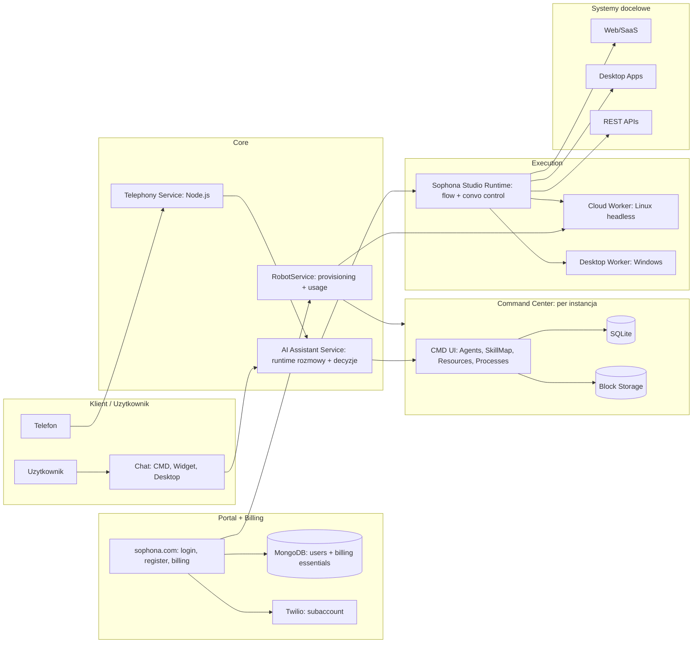

# Sophona – onboarding produktowo‑architektoniczny (wersja partnerska)

Sophona to nie tylko „agenci AI”. To jest połączenie:

* **Conversational AI** (jak Kore.ai)
* **Automation / iPaaS** (jak n8n / Workato / SnapLogic)
* **RPA / UI automation** (jak UiPath)

Wszystko spięte w jeden runtime, gdzie rozmowa, procesy, UI i API działają razem.

---

## 1) Portal + Billing (sophona.com)

**Po co jest:**

* landing + rejestracja + logowanie
* zakup Pro (49$ / miesiąc)
* dashboard użytkownika
* zarządzanie instancjami / slotami

**Dane:**

* MongoDB: tylko essential (email, id, imię)

**Pro plan (ważne dla operacji):**

* 49$ / miesiąc
* 10$ w kredytach (AI tokeny / voice / telefony)
* możliwość doładowań
* 1 slot instancji CMD w pakiecie
* kolejne sloty: 20$ / szt.

**Telephony provisioning:**

* przy rejestracji automatycznie tworzymy użytkownikowi **subkonto Twilio**

---

## 2) Command Center (CMD) – centrum operacyjne

**Adresy:**

* sophona.com = portal
* free.sophona.com = darmowe CMD (multi‑tenant)
* sophona.app = instancje Pro/Dedicated

**CMD to panel, w którym organizacja:**

* tworzy agentów
* konfiguruje kanały (chat, voice, widget)
* projektuje Skill Map (graf)
* podpina workery/zasoby
* zarządza skills, procesami i schedulerami

**Persistence:**

* SQLite + block storage

**Izolacja/infra:**

* wszystko na Kubernetes (OVH + AWS)
* per instancja CMD: osobny namespace, HPA + vertical scaling

---

## 3) Conversational AI (chat / voice / multimodal)

### Chat (w CMD oraz w widgetach)

**Dostępne:**

* chat tekstowy
* voice (w ramach czatu)
* wysyłanie obrazów
* markdown + code blocks (jak w ChatGPT)

**W roadmapie (blisko):**

* bogatsze outputy: PDF, Excel, obrazy, wideo itd.

### Agent wizard (tworzenie agenta)

Konfiguracja (kroki):

* nazwa, rola, wygląd
* avatar: statyczny obraz lub HeyGen
* personality (ton, humor)
* intelligence: model (obecnie OpenAI), temperatura, advanced system prompt
* **job description (wymagane)**
* voice: STT (Azure/Deepgram), TTS (ElevenLabs), barge‑in on/off

---

## 4) Skill Map / Graph (sterowanie narzędziami bez chaosu)

To nie jest lista tooli. To **graf**:

* kilka rootów startowych
* kolejne węzły “odkrywane” zależnie od przebiegu rozmowy
* mniej pomyłek i lepszy kontekst

### AI w Skill Map

* **Generate graph (Live)**: z job description buduje mapę z istniejących skills w danym CMD
* **Draft (AI)**: proponuje nowe skills → tworzy puste “szkielety” z opisem → do dokończenia w Studio

---

## 5) Automation / iPaaS / Robot‑as‑a‑Service

Sophona ma warstwę procesów podobną do iPaaS:

* procesy (flows) mogą łączyć integracje API + kroki RPA/UI
* procesy mogą być uruchamiane:

  * ręcznie
  * przez scheduler (cron)
  * przez endpoint API (proces jako usługa)

Praktycznie: możesz zbudować „biznesowy proces” i odpalać go jak integrację (Workato/SnapLogic), nawet jeśli część kroków wymaga UI automatyzacji.

---

## 6) Studio + Workery (RPA + kontrola konwersacji)

**Sophona Studio** to cross‑platform (.NET):

* Windows (desktop)
* Linux (cloud worker, headless)

### RPA / UI automation (jak UiPath)

* indicate on screen
* locatory
* klikanie po UI Windows
* automatyzacja przeglądarki (Selenium)
* headless na Linux cloud worker

### Mega ważne: Studio steruje też konwersacją

Flow w Studio to nie tylko “task automation”. To **orkiestracja zachowania agenta**.

Przykładowe bloki:

* **Get User Input** – proces w runtime zatrzymuje się, agent pyta użytkownika o brakujące dane (entity), po czym flow kontynuuje.
* logika: zmienne, warunki, pętle
* **Invoke C#** (kod)
* własne bloczki jako NuGet packages

### Mind Inject (kontrola LLM w biznesowych ramach)

W flow można wstrzyknąć „assistant message” tak, aby LLM traktował to jak swoją własną myśl/wniosek.
Efekt:

* deterministyczne prowadzenie zachowania
* wymuszanie zasad/kroków
* ograniczanie “odjazdów” modelu
* wszystko w czasie rzeczywistym (runtime)

### LLM widzi zmienne runtime bez tarcia (praktyczna przewaga vs n8n)

* LLM ma bezpośredni dostęp do wartości zmiennych
* dane z runtime są **deserializowane** do form, które model rozumie (np. tablice, datatable, obiekty)
* nie trzeba ręcznie “przerabiać na JSON” i mapować jak w klasycznych narzędziach flow

Przykład (intuicyjnie):

* n8n: Gmail → parsowanie → mapowanie → formaty → dopiero potem logika
* Sophona: autoryzujesz Google → agent czyta maila → LLM od razu widzi treść + pola jako runtime variables

---

## 7) Execution / Resources (podpinanie maszyn)

W CMD podpinasz zasoby (komputery/VM/cloud workery):

* SignalR, klucze maszynowe
* CMD jako serwer, maszyny jako klienci

**Obecnie:** wybór maszyny na sztywno

**W development:**

* preferred worker + automatyczny fallback na dostępną maszynę

---

## 8) Kanały: widget, desktop, telephony, avatar

### Widget (osadzany)

* deploy po API key
* whitelist domen
* działa jako chat UI + autonomiczny web agent (klika/pisze/sprawdza UI)

### Desktop widget (Electron)

* Windows + macOS
* “personalny asystent na komputerze” (np. HR buddy, IT support)

### Telephony (Twilio)

* użytkownik może podpiąć swój numer lub kupić numer w CMD (kilka sekund)
* numer przypięty do agenta

Roadmapa:

* Humans tab: repo osób i ról w organizacji
* rozpoznawanie rozmówcy po numerze

### Avatar

* HeyGen LiveAvatar (działa)

---

## 9) Core services (kto za co odpowiada)

### AI Assistant Service (centralny runtime)

* sesje rozmowy + wymiana z LLM
* logika zachowania agenta
* pobiera metadane agenta z CMD
* **komunikuje się bezpośrednio z workerami** (dla szybkości)

### Telephony Service (Node.js)

* obsługa połączeń
* routing rozmów do AI Assistant

### RobotService

* provisioning CMD i cloud workerów (Helm install)
* billing/usage, kredyty
* integracje wewnętrzne (Twilio actions, maile, reset haseł)

---

## 10) Diagram architektury (runtime + szybkość)

Najważniejsze: kanały (chat/widget/voice) łączą się do **AI Assistant**, a ten wykonuje akcje **bezpośrednio przez runtime Studio/workerów** (dla szybkości). CMD dostarcza konfigurację i zasoby.

---

## 10A) Orientacja „po ludzku” – jak to działa, gdybyś tłumaczył komuś na callu

Wyobraź sobie Sophonę jako firmę złożoną z kilku działów, które współpracują w czasie rzeczywistym.

**1) sophona.com to recepcja i księgowość.**
Tu użytkownik zakłada konto, płaci za Pro, ma dashboard, kredyty itd. W bazie trzymamy tylko minimalne dane, bo cała „prawdziwa praca” dzieje się dalej. Przy rejestracji automatycznie tworzymy mu subkonto Twilio, żeby telefony działały od razu.

**2) Command Center to Twoje biuro operacyjne.**
To panel, w którym budujesz agentów: definiujesz kto to jest, jak mówi, jaki ma model, jaki ma job description, jakie ma kanały (chat/voice/widget), jakie ma zasoby. CMD jest też miejscem, gdzie składasz „mapę umiejętności” (Skill Map) i trzymasz katalog skills i procesów.

**3) AI Assistant Service to mózg, który prowadzi rozmowę i podejmuje decyzje.**
Kiedy ktoś pisze na czacie, używa widgetu albo dzwoni – to nie idzie do CMD ani do workera. To trafia do AI Assistant. On trzyma sesję rozmowy, gada z LLM i wie, co agent ma zrobić. Z CMD tylko dociąga metadane/konfigurację agenta.

**4) Studio/Workery to ręce, które faktycznie wykonują pracę.**
Jeśli trzeba kliknąć coś w UI, zalogować się do aplikacji, przejść po stronie, odpalić Selenium headless albo wykonać integrację – to robi runtime Studio na workerze (cloud Linux albo desktop Windows). I ważne: AI Assistant gada z tym runtime bezpośrednio, żeby było szybciej.

**5) Studio nie jest tylko „RPA jak UiPath”, tylko steruje też rozmową.**
Flow w Studio może w trakcie poprosić użytkownika o brakujące dane (Get User Input), czyli proces się zatrzymuje, agent zadaje pytanie, a potem wraca do wykonywania. To powoduje, że rozmowa i proces są jednym mechanizmem.

**6) Mind Inject to taki “kierownik operacyjny” dla LLM.**
W flow możesz wstrzyknąć komunikat, który LLM traktuje jak własną myśl, dzięki czemu trzymasz go w biznesowych ramach: zasady, kolejność kroków, polityki, compliance – i to działa w runtime, a nie jako statyczny prompt.

**7) Największa różnica vs n8n/Workato: LLM widzi dane procesu tak jak są.**
W typowych narzędziach musisz mapować JSON-y, robić konwersje i składać payloady. U nas runtime trzyma zmienne (nawet złożone struktury typu tabelki), a LLM ma do nich dostęp „wprost” – bo są deserializowane na bieżąco do formatu, który model rozumie. To skraca czas budowania integracji i usuwa mnóstwo klejenia.

W skrócie:

* CMD = konfiguracja i zasoby
* AI Assistant = rozmowa + decyzje
* Studio/Workery = wykonanie + kontrola flow + kontrola konwersacji
* Portal = konto, billing, provisioning

To dlatego Sophona jest jednocześnie conversational AI + iPaaS + RPA, ale nie jako trzy osobne produkty – tylko jako jeden spójny runtime.

---

## 11) Realtime API

**Status: w development**

* niska latencja / streaming
* przebudowa po zmianach architektonicznych

---

## 12) User Memory

**Status: w development**

* długoterminowa pamięć użytkownika

---

## 13) Unikaty Sophony (krótko, technicznie)

1. Jedna platforma łącząca Conversational + iPaaS + RPA
2. Studio steruje konwersacją (Get User Input) i logiką w runtime
3. Mind Inject – realna kontrola zachowania LLM “od środka” procesu
4. LLM ma dostęp do zmiennych i struktur runtime bez ręcznego JSON‑owania
5. AI Assistant wykonuje akcje bezpośrednio przez runtime workerów (szybkość i spójność)

---

## Czym tak naprawdę jest Sophona (wytłumaczone normalnie)

Sophona to platforma do budowania systemów, które **rozumieją rozmowę i potrafią wykonać realną pracę**.

W typowych rozwiązaniach te rzeczy są rozdzielone: chatboty rozmawiają, narzędzia integracyjne wykonują procesy, a RPA klika po interfejsach. Sophona łączy to w jedno.

Użytkownik po prostu rozmawia z agentem – tekstowo albo głosowo. W trakcie tej rozmowy agent sam decyduje, co trzeba zrobić: może uruchomić proces, wywołać API, zalogować się do aplikacji, kliknąć coś w UI albo dopytać o brakujące informacje. Całość dzieje się w jednej, spójnej interakcji.

Najważniejsze jest to, że rozmowa nie jest tylko „frontem”. Rozmowa steruje wykonaniem. Agent w czasie rozmowy ma dostęp do danych, wyników działań i stanu procesu, więc nie zgaduje – tylko działa na realnych informacjach.

Dla firmy oznacza to, że zamiast budować osobno chatbota, integracje, automatyzacje i procesy, buduje się jednego agenta, który obsługuje ludzi i systemy jednocześnie.

Sophona nie jest narzędziem do pisania flow ani kolejnym chatbotem. To platforma do tworzenia **cyfrowych pracowników**, którzy potrafią rozmawiać, podejmować decyzje i wykonywać zadania tak, jak robiłby to człowiek – tylko szybciej i bez przerw.

---
