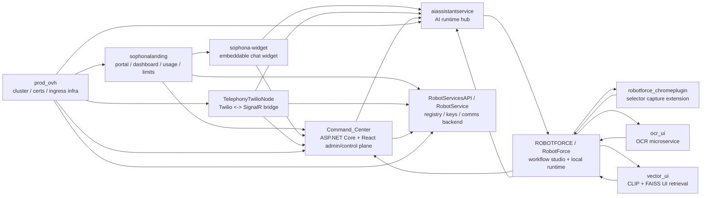

# Readme Sophona - analiza ekosystemu

## Cel dokumentu
Ten dokument zbiera informacje o repozytoriach i komponentach tworzących ekosystem RobotForce / Sophona. Skupia się głównie na tym, **co już istnieje w kodzie**, jak poszczególne moduły są zbudowane, jak się łączą oraz jakie ryzyka i nieścisłości są widoczne podczas przeglądu.

## Zakres analizy
Przeanalizowane ścieżki:
- `C:\Users\micha\source\repos\robotforce\Telephony\TelephonyTwilioNode`
- `C:\Users\micha\source\repos\robotforce\aiassistantservice`
- `C:\Users\micha\source\repos\robotforce\Command_Center`
- `C:\Users\micha\source\repos\robotforce\ROBOTFORCE`
- `C:\Users\micha\source\repos\robotforce\RobotServicesAPI`
- `C:\Users\micha\source\repos\sophonachatwidget\sophona-widget`
- `C:\Users\micha\source\repos\sophonalanding`
- `C:\Users\micha\source\repos\standalonewidget`
- `C:\Users\micha\source\repos\ocr\ocr_ui`
- `C:\Users\micha\source\repos\vector_ui`
- `C:\Users\micha\source\repos\robotforce_chromeplugin`
- `C:\Kubernetes\prod_ovh`

---

# 1. Obraz całości

## Główne domeny systemu
Ekosystem jest podzielony na kilka obszarów funkcjonalnych:

1. **Command / control plane**
   - `Command_Center`
   - `RobotServicesAPI`

2. **Agent / AI / chat / voice**
   - `aiassistantservice`
   - `sophona-widget`
   - `TelephonyTwilioNode`

3. **Customer portal / onboarding / billing / limits**
   - `sophonalanding`

4. **Automation / workflow studio / local runtime**
   - `ROBOTFORCE`
   - `robotforce_chromeplugin`
   - `ocr_ui`
   - `vector_ui`

5. **Infra / deployment**
   - `prod_ovh`

---

## Diagram relacji komponentów

---

# 2. Repo po repo

## 2.1 TelephonyTwilioNode
### Rola
Node.js / Fastify service będący mostem pomiędzy Twilio Voice / Media Streams, SignalR AI hubem oraz backendami Command/RobotService.

### Funkcjonalność
- inbound calls
- outbound calls
- outbound init
- websocket media bridge
- warmup sesji AI
- attach do sesji po `sessionId`

### Integracje
- Twilio
- SignalR AI hub
- telephony access i agent lookup
- registry lookup po numerze telefonu

### Wnioski
To adapter warstwy telephony, nie główny runtime AI.

### Ryzyka
- zaszyty sekret TOTP
- błędy częściowo zwracane jako string
- wysokie sprzężenie z backendami

---

## 2.2 aiassistantservice
### Rola
Centralny backend AI assistant odpowiedzialny za sesje czatu, voice, widgetu oraz połączenia z runtime maszyn i skilli.

### Potwierdzone pliki
- `Program.cs`
- `ChatBotHub.cs`
- `RealTimeVoice.cs`
- `AiAssistantRobotForce.csproj`
- `appsettings.json`

### Najważniejsze funkcje
`ChatBotHub` obsługuje:
- start widgetu
- start phone session
- attach audio
- łączenie maszyn i skill runtime
- wysyłanie wiadomości i audio
- voice start/stop
- historię sesji
- widget automation
- runtime variables
- SMS
- odpowiedzi robotów
- analitykę i cleanup sesji

### Wnioski
To serce runtime AI. Łączy:
- widget,
- telephony,
- machine runtime,
- skill runtime,
- logowanie i analitykę.

### Ryzyka
- twarde klucze Deepgram / OpenAI / Azure w kodzie lub configu
- szeroki CORS
- duża odpowiedzialność w jednym hubie
- sesje trzymane w pamięci procesu utrudniają skalowanie

---

## 2.3 Command_Center
### Rola
Centralny panel administracyjny i control plane platformy.

### Technologie
- ASP.NET Core 8
- SignalR
- JWT
- React
- Helm / Docker / Kubernetes

### Funkcje
- users
- agents
- jobs / scheduler
- resources / machines / queues / processes
- AI chat
- widget deployment
- telephony integrations

### Szczególnie ważne
- `Program.cs` ma auth, swagger, rate limiting, vector store services
- `MainHub.cs` mapuje połączenia, job statusy, widget keys, upload procesu

### Ryzyka
- jawne sekrety
- interpolowany SQL
- duża centralizacja logiki

---

## 2.4 ROBOTFORCE / RobotForce
### Rola
Workflow studio i lokalny runtime robota z frontendem, lokalnym SignalR hubem i integracją SSO z Command Center.

### Potwierdzone pliki
- `Program.cs`
- `SignalHub.cs`
- `RobotForce.csproj`
- `appsettings.json`

### Co robi
- uruchamia lokalny host ASP.NET
- wystawia `/robotsignal`
- serwuje frontend `Vite/dist`
- serwuje `SelectorExplorer`
- obsługuje local auth flow przez token i redirect do Command Center
- czyta `machineKey` i `commandCenterUrl`
- pobiera webdrivery
- wspiera uruchamianie procesu z `--data`

### Co potwierdza `RobotForce.csproj`
Repo składa się z modułów:
- `BrowserAutomationEngine`
- `CommonRobotForce`
- `NugetInstaller`
- `RobotExecutor`
- `RobotFileModel`
- `NativeAutomationEngine` (Windows)
- `ScreenshotOCR` (Windows)
- `robot_modules`
- `SelectorExplorer`

### Wnioski o bloczkach workflow
To już bardzo mocno potwierdza obszary pluginów/bloków:
- browser automation
- native desktop automation
- OCR i screenshot analysis
- selector-based actions
- robot execution blocks
- file/model based process blocks

### Ryzyka
- szeroki CORS
- historyczny martwy `Startup.cs`
- obecność `TemporaryKey.pfx`
- złożony local auth redirect flow

---

## 2.5 RobotServicesAPI / RobotService
### Rola
Backend usług pomocniczych: registry, klucze, email/telephony communications, provisioning assets.

### Potwierdzone pliki
- `Program.cs`
- `Auth.cs`
- `CustomKeys.cs`
- `Totpkey.cs`
- `RobotService.csproj`

### Co już wiadomo
- auth części endpointów oparty o TOTP
- generowanie specjalnych kluczy `robotMagicKey`
- zależności do MongoDB, Twilio, SendGrid, Gmail, MimeKit
- assets email templates
- assets Helm
- folder `TwilioRegistry`

### Wnioski
Ten serwis prawdopodobnie obsługuje:
- service registry
- telephony registry
- wysyłki mailowe i onboarding
- klucze systemowe i provisioning
- wsparcie deploymentów helmowych

### Ryzyka
- zaszyty sekret TOTP
- plik `.p12` kopiowany do outputu
- pełna mapa endpointów nadal wymaga odczytu kontrolerów

---

## 2.6 sophona-widget
### Rola
Embeddowalny widget czatu / AI dla stron klientów.

### Kluczowe elementy
- `PopupWidget.tsx`
- `PopupWidgetEmbed.tsx`

### Co robi
- pobiera konfigurację po `apiKey`
- działa przez Shadow DOM
- udostępnia `window.SophonaChatWidget`
- wspiera tryb mobile/fullscreen
- wspiera voice/video avatar i dynamiczny widget style

### Ryzyka
- twardy testowy apiKey w `App.jsx`
- duży komponent UI
- literówka `prefferedLanguage`

---

## 2.7 sophonalanding
### Rola
Portal klienta / customer dashboard / billing / limits / usage.

### Co jest potwierdzone
- auth przez next-auth
- middleware dashboard guard
- istniejący system usage/limits/credits
- komponenty dashboardowe i raportowanie

### Wnioski
To warstwa komercyjna i onboardingowa systemu.

### Ryzyka
- README z template nie odpowiada realnemu systemowi

---

## 2.8 standalonewidget
### Stan
Pusty odczyt katalogu.

---

## 2.9 ocr_ui
### Rola
OCR i image matching microservice.

### Ryzyka
- maskowanie `HTTPException`
- tylko język angielski
- brak walidacji plików
- niespójność README z implementacją

---

## 2.10 vector_ui
### Rola
Semantyczne wyszukiwanie elementów UI przez CLIP + FAISS.

### Funkcje
- add/search UI elements
- image search
- search and highlight
- import/export indexów

### Ryzyka
- brak auth
- lokalne pliki indexów
- eksperymentalny charakter części logiki

---

## 2.11 robotforce_chromeplugin
### Rola
Rozszerzenie Chrome do wyboru elementów, screenshotów i przekazywania selektorów do RobotForce.

### Funkcje
- overlay highlight
- capture `outerHTML`, DOM i coordinates
- screenshot karty
- postMessage do host page

### Ryzyka
- szerokie permissions
- pełne `document.body.innerHTML`
- pusty popup.js

---

## 2.12 prod_ovh
### Rola
Manifesty K8s dla środowiska produkcyjnego.

### Funkcje
- cert-manager
- wildcard certs
- ingress HPA
- storage class
- helm controller

### Ryzyka
- `cluster-admin`
- kubeconfig wymaga ostrożności

---

# 3. Jak to się łączy

## A. Portal klienta
`sophonalanding`
- auth
- organizacje
- limity
- usage
- billing/credits

## B. Control plane
`Command_Center`
- zarządza agentami, jobami, maszynami i konfiguracją

## C. AI runtime
`aiassistantservice`
- utrzymuje sesje czatu i voice
- rozmawia z widgetem, telefonią i runtime maszyn

## D. Widget klienta
`sophona-widget`
- osadzany na stronach klientów
- komunikuje się z backendem AI i command services

## E. Telephony
`TelephonyTwilioNode`
- łączy Twilio z AI runtime

## F. Workflow studio i wykonanie
`ROBOTFORCE` + `robotforce_chromeplugin` + `ocr_ui` + `vector_ui`
- projektowanie i wykonywanie automatyzacji
- selektory, OCR, browser/native automation

## G. Service backend
`RobotServicesAPI`
- registry, klucze, telephony/email support, provisioning assets

## H. Infra
`prod_ovh`
- klaster, TLS, ingress, storage

---

# 4. Pluginy i bloczki workflow w ROBOTFORCE

## Co jest już potwierdzone mocniej niż wcześniej
Na podstawie `RobotForce.csproj` i repo wspierających można uznać za potwierdzone obszary bloków/pluginów:
- browser automation blocks
- native automation blocks
- selector explorer / UI selector blocks
- OCR / screenshot recognition blocks
- robot execution blocks
- plikowe / modelowe bloki procesu
- moduły ładowane z `robot_modules`

## Co nadal wymaga jeszcze pełniejszej inwentaryzacji
Żeby zrobić pełną listę wszystkich bloczków nazwami 1:1, trzeba jeszcze przeczytać dodatkowe katalogi modułów rozwiązania:
- `BrowserAutomationEngine`
- `NativeAutomationEngine`
- `RobotExecutor`
- `RobotFileModel`
- `robot_modules`

Ale już teraz widać, że studio nie jest prostym frontendem, tylko realną platformą authoringowo-wykonawczą.

---

# 5. Lista ryzyk / bugów / niespójności

## Wysoki priorytet
1. **Sekrety w repo / kodzie**
   - `Command_Center/appsettings.json`
   - `TelephonyTwilioNode/requests.js`
   - `aiassistantservice/Program.cs`
   - `aiassistantservice/RealTimeVoice.cs`
   - `aiassistantservice/appsettings.json`
   - `RobotServicesAPI/Auth.cs`
   - `sophona-widget/App.jsx`

2. **Skalowanie i statefulness AI runtime**
   - `aiassistantservice` trzyma sesje w pamięci procesu
   - wymaga sticky routing albo external state przy skalowaniu poziomym

3. **Interpolowany SQL w centralnych backendach**
   - szczególnie `Command_Center`

4. **Szerokie CORS / credentials**
   - `aiassistantservice`
   - `ROBOTFORCE`

## Średni priorytet
5. **Niepełna dokumentacja root repo**
   - szczególnie `sophonalanding`

6. **Chrome plugin i prywatność danych**
   - przesyłanie pełnego DOM

7. **Szerokie uprawnienia infrastrukturalne**
   - `cluster-admin` dla helm controller

8. **Pliki cert/key w repo lub outputach**
   - `RobotForce_TemporaryKey.pfx`
   - `.p12` w `RobotServicesAPI`

## Niski / obserwacyjny priorytet
9. **Duże klasy hubów**
   - `ChatBotHub.cs`
   - `MainHub.cs`

10. **Historyczny / martwy kod**
   - `Startup.cs` w `ROBOTFORCE`
   - eksperymentalny `RealTimeVoice.cs`

---

# 6. Ocena gotowości pod user stories

## Najlepiej odsłonięte domeny
- telephony bridge
- AI runtime hub
- command center
- widget embed
- portal limits/usage
- OCR / vector UI
- chrome plugin
- workflow/runtime host RobotForce

## Co jeszcze warto przeanalizować przed finalnym importem do Azure DevOps
Aby zrobić naprawdę dokładne user stories 1:1 z kodem, warto jeszcze wejść w:
- kontrolery `RobotService`
- moduły `BrowserAutomationEngine`
- `NativeAutomationEngine`
- `RobotExecutor`
- `robot_modules`
- frontend `Vite` w `RobotForce`

To pozwoli rozpisać stories nie tylko per repo, ale też per capability / plugin / workflow block.

---

# 7. Podsumowanie końcowe
Po głębszym skanie widać już wyraźnie, że platforma składa się z trzech głównych silników:

1. **Command / admin engine**
   - `Command_Center`

2. **AI conversation engine**
   - `aiassistantservice`
   - `sophona-widget`
   - `TelephonyTwilioNode`

3. **Automation / execution engine**
   - `ROBOTFORCE`
   - `robotforce_chromeplugin`
   - `ocr_ui`
   - `vector_ui`

oraz dwóch warstw wspierających:
- **customer portal / billing** - `sophonalanding`
- **service backend / registry / comms** - `RobotServicesAPI`

Najważniejszy nowy wniosek z etapu 2:
`ROBOTFORCE`, `aiassistantservice` i `RobotServicesAPI` nie są już tylko "domyślane" architektonicznie — ich role są teraz dużo lepiej potwierdzone kodem. Szczególnie:
- `aiassistantservice` jest realnym runtime sercem AI,
- `ROBOTFORCE` jest realnym hostem/studio automatyzacji,
- `RobotServicesAPI` jest zapleczem usług pomocniczych, registry i provisioning/comms.
